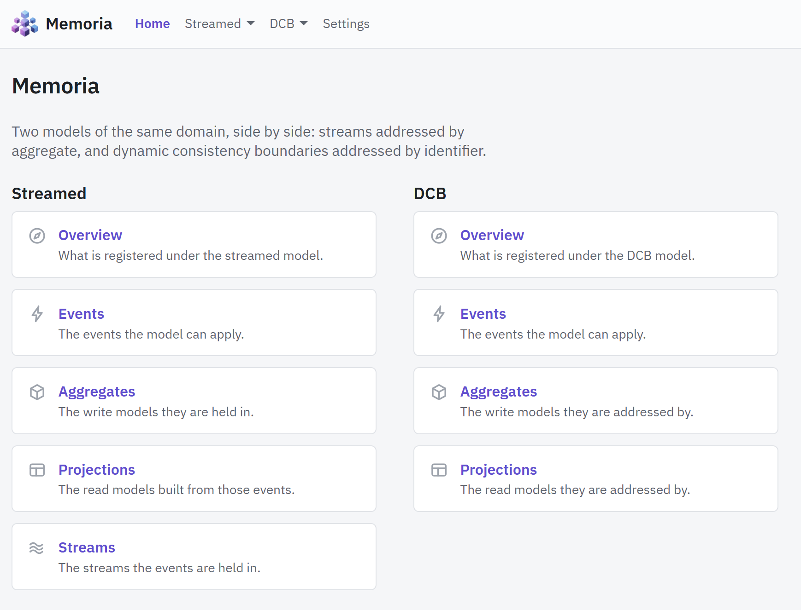
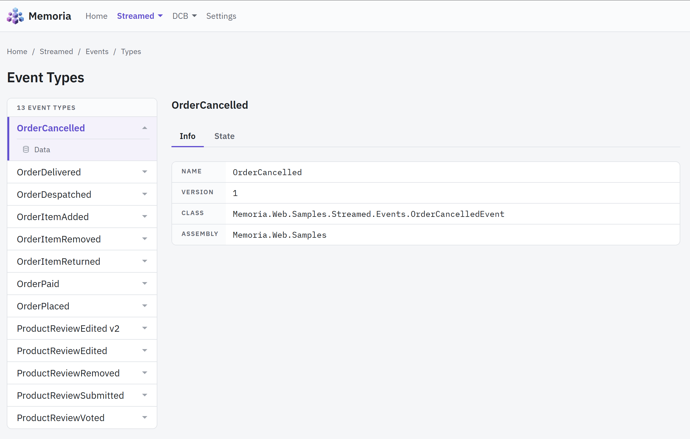
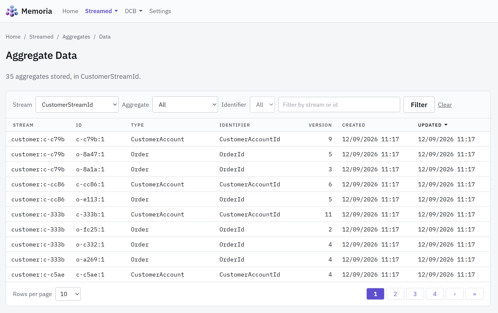
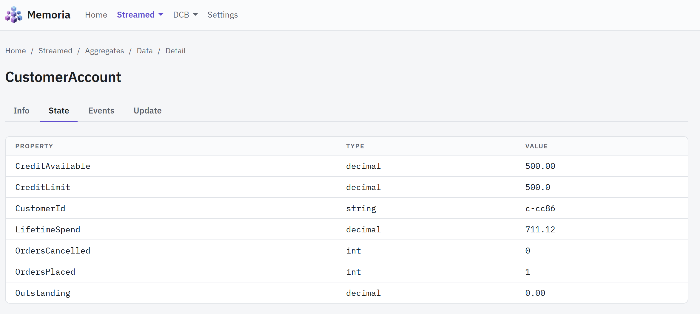

# Memoria Web

Memoria Web is a browser tool for reading a Memoria store. Point it at a database, upload a zip of
your own domain assemblies, and it shows you the events that were appended, the aggregates and
projections snapshotted from them, and the types both were written through.

It is not a sample application and not a package. It lives in the repository at
[`src/Memoria.Web`](https://github.com/lucabriguglia/Memoria/tree/main/src/Memoria.Web), and you
build and run it yourself — see [Deployment](memoria-web-deployment.md).

- [Configuration](memoria-web-configuration.md) — the connection string, the provider, the Cosmos
  database and container, where uploads are kept
- [Deployment](memoria-web-deployment.md) — publishing it, hosting it, and what has to be true of
  the host
- [Try it with sample data](memoria-web-samples.md) — a store filled in a couple of minutes, with no
  domain of your own needed

## Why it needs your assemblies

A Memoria store holds serialised payloads under type bindings — `OrderPlaced` at version 1, an
aggregate under `[AggregateType("Order")]`. The bindings are names; the shapes they name live in
your assemblies. Without them the tool could list rows and nothing else: it could not say what an
event carries, fold a stream into an aggregate, or work out which snapshots a boundary should hold.

So the tool has no reference to any domain at all. You upload assemblies on the **Settings** page,
it scans them for the types both consistency models declare, and registers what it finds:

| Model    | Scanned for                                                                             |
| -------- | --------------------------------------------------------------------------------------- |
| Streamed | `IStreamId`, `IAggregateRoot`, `IAggregateId`, `IProjection`, `IProjectionId`, `IEvent`  |
| DCB      | `IDcbAggregateRoot`, `IDcbAggregateId`, `IDcbProjection`, `IDcbProjectionId`, `IEvent`   |

Events are one bound set — an event is the same event whichever model appends it — so an event both
models apply is counted under both.

The assemblies are read from bytes rather than from their path, and the registrations are rebuilt
from scratch on every upload, removal and refresh. Nothing restarts, and a type you removed from a
rebuilt assembly stops being offered rather than lingering from the previous load.

## What it shows

The two consistency models sit side by side from the home page, and each is laid out the same way:

- **Overview** — what is registered under that model, counted per section
- **Events**, **Aggregates**, **Projections** (and **Streams**, streamed only) — each a section with
  a **Types** page (what the uploaded assemblies declare) and a **Data** page (what the store holds)

A **Types** page reads the registration rather than the store: what each type is bound as, at which
version, and the assembly it came out of.

Data pages page, sort and filter, and every piece of that state — the filter, the sort, the page, the
page size, which payloads are expanded — travels in the query string, so a view can be bookmarked,
shared and stepped back through.

| Page                          | Narrowed by                                          |
| ----------------------------- | ---------------------------------------------------- |
| Streamed → Events → Data      | Stream, event type, and text in the payload          |
| Streamed → Aggregates → Data  | Aggregate type, identifier, and text                 |
| Streamed → Projections → Data | Projection type, identifier, and text                |
| DCB → Events → Data           | Event type, and text in the payload **or in a tag**  |
| DCB → Aggregates → Data       | Aggregate type, identifier, and text in a tag        |
| DCB → Projections → Data      | Projection type, identifier, and text in a tag       |

Opening a row reaches a detail page with five tabs: **Info** (how the row is identified and where its
snapshot stands), **State** (the model folded), **Json** (the stored payload itself), **Events** (what
it applied, or what its boundary holds), and **Update**.

**State** and **Json** show the same payload two ways. State reads it through the model's own
properties; Json shows the text the store holds, laid out one value per line and coloured by kind,
in a box that scrolls once it grows past the screen. It is the row's own text rather than the model
serialised again, so a payload the model cannot read back, or one carrying more than the model
declares, is still there to see — and a payload that is not JSON at all is shown as it is, under a
note saying why it could not be laid out. A **Copy** button above the box puts the laid-out text on
the clipboard; it appears only where the browser allows the page to write there, which means a
secure context: `localhost` or HTTPS.

## The one thing it writes

**Update** refreshes a stored snapshot: the events the model has not applied yet are applied to it
and the result is written back. That is the whole of it. The tool never appends an event, never
deletes a row, and never creates a database, a container or a table — it opens what is already
there, and a store whose schema is missing is an error the page reports rather than something it
installs.

A snapshot that is already current, and a model with nothing to fold, both say so and write nothing.

## What each store answers

| Engine     | Streamed | DCB | Notes                                                    |
| ---------- | -------- | --- | -------------------------------------------------------- |
| PostgreSQL | ✅       | ✅  | Read through Entity Framework Core                       |
| SQL Server | ✅       | ✅  | Read through Entity Framework Core                       |
| SQLite     | ✅       | ✅  | Against a file; an in-memory database is refused         |
| Cosmos DB  | ✅       | ❌  | Read through the Cosmos SDK, the way the store writes it |

There is no Cosmos DB store for dynamic consistency boundaries, and the model would not build on that
provider if there were — see
[Providers](../concepts/providers.md#why-there-is-no-cosmos-db-provider-for-dcb). Under a Cosmos
store the DCB menu is not shown and its addresses answer 404, so a bookmark says the same thing the
menu does.

Cosmos also cannot fully order a page of results, and falls back to ordering by date alone: every row
is there, but rows written at the same moment can move between pages. Pages under that store say so,
and the note can be turned off under **Settings → Preferences**.

## Everyone shares one set of types

Type registration lives in Memoria's process-wide bindings, so one person's upload, removal or
refresh changes what every user of that server resolves. There is no push: other people's open pages
catch up when the browser is reloaded. The Settings page says this under both tabs that can cause it.

Browser preferences — theme, rows per page, whether the ordering note is shown — are the exception.
They are stored in the browser and the server is never told.

## Security

> **The tool has no authentication or authorization today, and uploading is running code.** Anyone
> who can reach `/settings` can upload a `.dll` that this process will load and execute. There is no
> login, no role, and no restriction on what an uploaded assembly may do. Both are planned for the
> next release; everything below describes the tool as it stands.

**Authentication and authorization are coming in the next release.** Until they land, the tool has
no notion of a user at all: every visitor can read every page and press every button, including the
ones that change what everyone else resolves. Plan for that rather than around it.

So for now, run it on localhost, or on a network where everyone who can reach it is already trusted
with the store it is pointed at. Do not expose it to the internet. If you must, put authentication in
front of it — a reverse proxy that requires a login before any request reaches the application — and
treat upload rights as equivalent to shell access on the host.

Two more things worth knowing before pointing it at anything that matters:

- **The connection string is the tool's whole authority.** Give it a read-only account unless you
  intend to use **Update**, which needs to write snapshots.
- **Uploaded archives persist.** They are kept on disk under the extensions directory and read again
  at the next start-up — see [Configuration](memoria-web-configuration.md#extensions).

## Requirements

- .NET 10 SDK to build it, or the ASP.NET Core 10 runtime to run a published build
- A store created by Memoria 1.9.0. The tool reads today's schema — `DomainEvents`,
  `DomainAggregates`, `DomainProjections` and the four `Dcb*` tables — so a database from an earlier
  version needs its [upgrade](../guides/upgrade-1.9.0.md) applied first
- Assemblies compiled against the same Memoria version the tool was built from. One built against an
  earlier version still loads, then contributes no types at all, and the Settings page reports the
  load error
